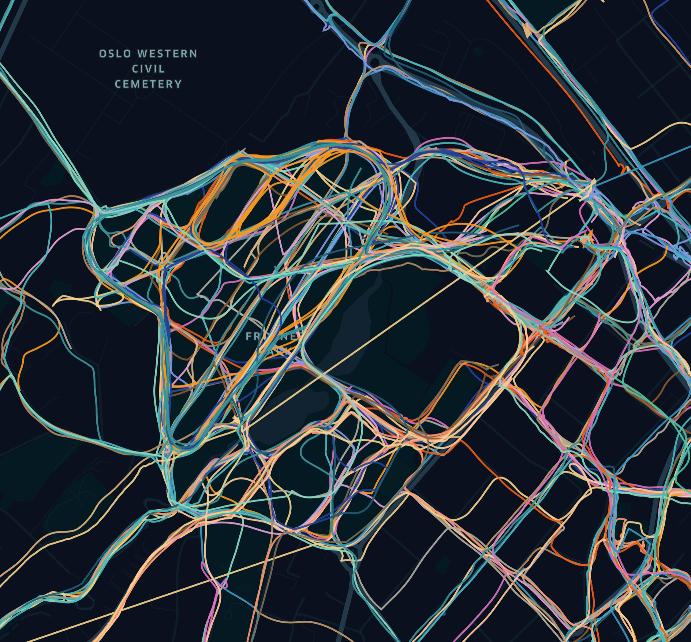
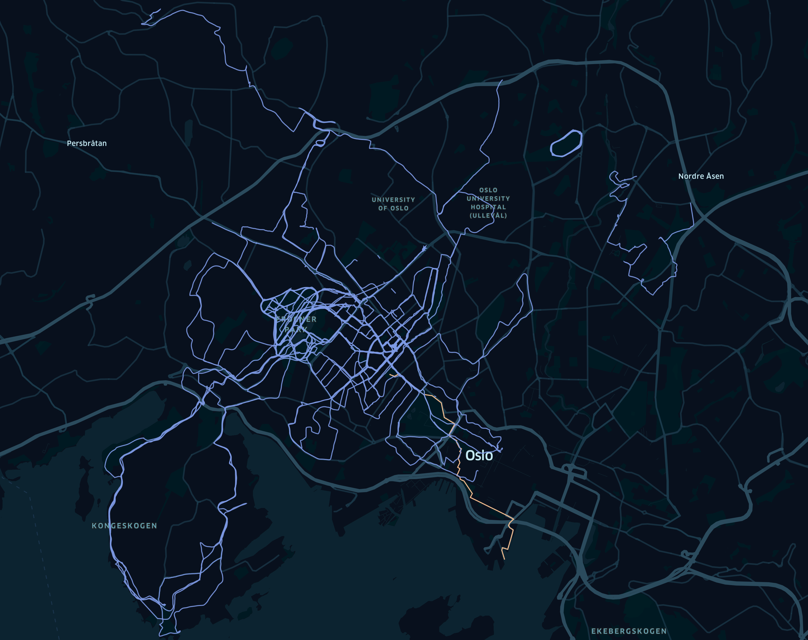

# run-chooser
a fun hackdays project to visualise and choose my next run. The code needs to be cleaned up a bit

## First it will load all runs

## Then it will try x number of routes and choose the one with the least overlap

